# Migration from Amazon RDS to Autonomous using Datapump

## Prerequisites
1.	Have the Autonomous Database Created. [Documentation Link]( https://docs.oracle.com/en/cloud/paas/atp-cloud/atpug/autonomous-provision.html#GUID-0B230036-0A05-4CA3-AF9D-97A255AE0C08)
2.	Have the AWS RDS Oracle database created. [Documentation Link]( https://docs.aws.amazon.com/AmazonRDS/latest/UserGuide/CHAP_GettingStarted.CreatingConnecting.Oracle.html)
3.	Create an S3 Bucket. [Documentation Link](https://docs.aws.amazon.com/AmazonS3/latest/gsg/CreatingABucket.html)
4.	Have the privileges set up to export and integrate with S3 storage. [Doumentation Link]( https://docs.aws.amazon.com/AmazonRDS/latest/UserGuide/oracle-s3-integration.html#oracle-s3-integration.preparing)

## Actions
The purpose of this document is to migrate the DCA schema from Amazon RDS to Autonomous Database.
The main steps are 
- Export the data from AWS RDS
- Copy the dumpfile to AWS S3 Storage
- Create credentials to AWS S3 Storage
- Datapump Import in Autonomous database.

Here are the details for each step:

### 5.	Datapump export in AWS RDS
Connect using SQL Developer

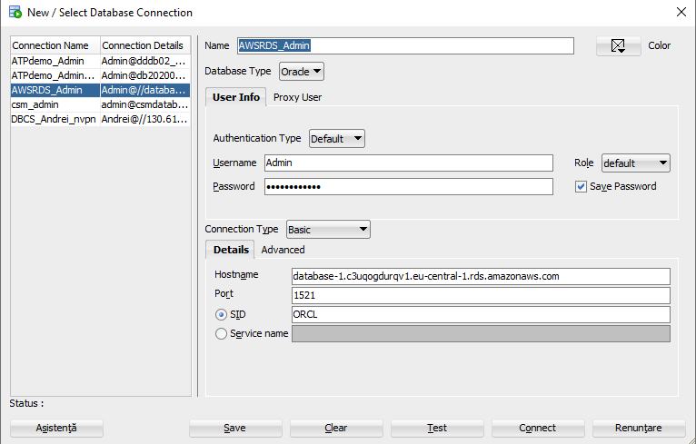

Run a simple query statement to select a table in the DCA schema that we are going to migrate.
```
Select * from dca.dca_sales_data;
```

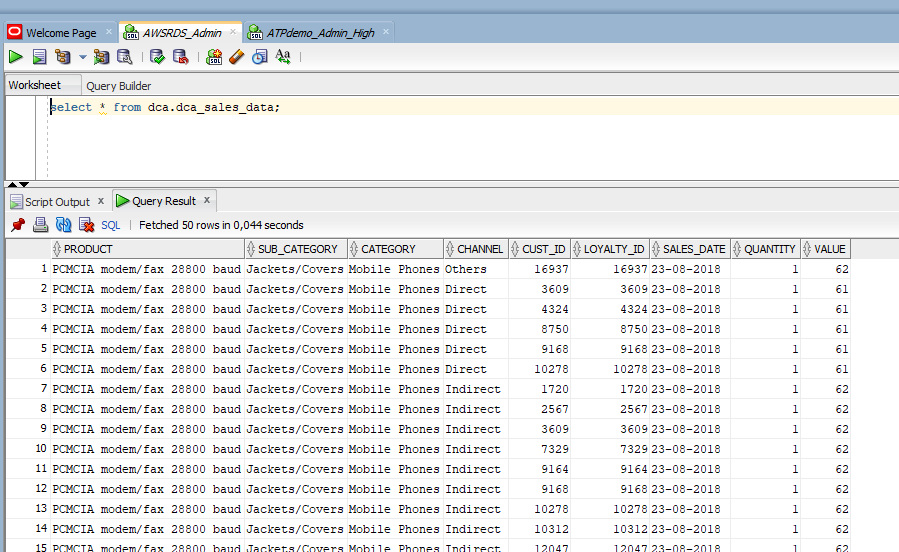

Add the connection to DBA Tab

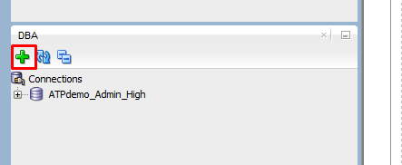

Select the connection and click OK

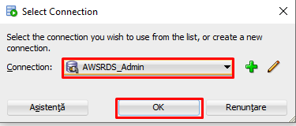

In the DBA tab select the AWS connection, expand Data Pump and right click on Export Jobs. Chose Data Pump Export Wizard.

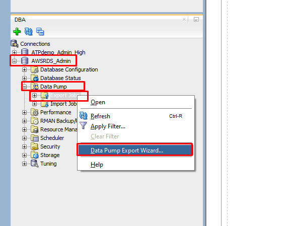

The Export wizard is launched. Chose Schemas export. And click Next.

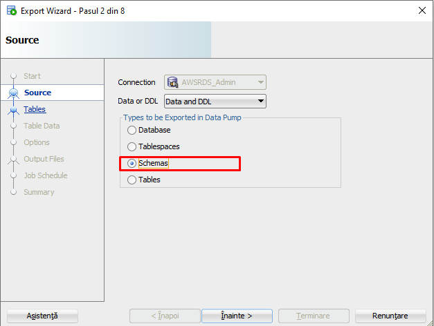

Chose the schema to be exported, in this case DCA. Click Next.

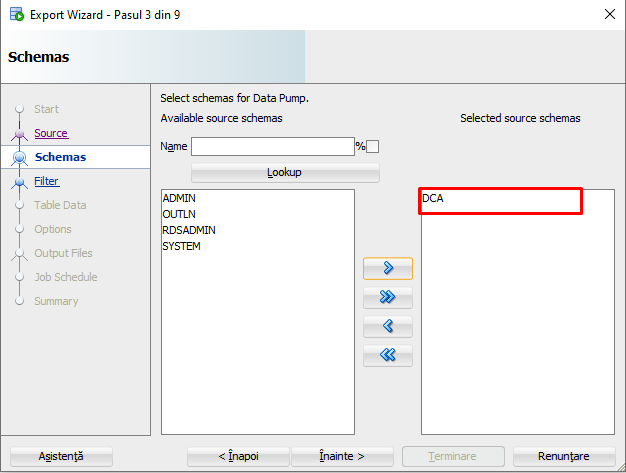

Click Next.

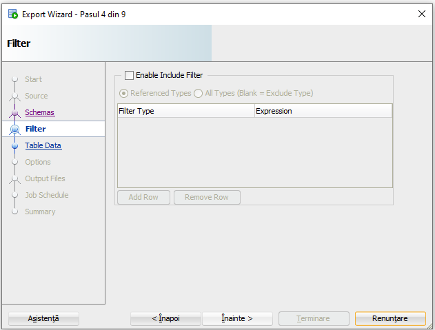

Click Next.

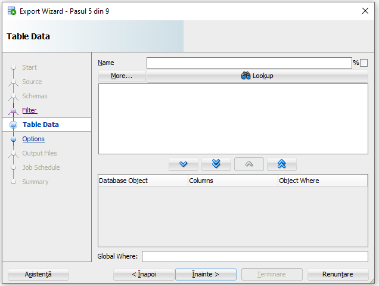

Click Next.

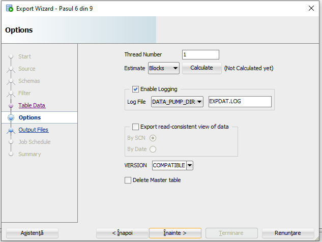

On the Output Files step you can limit the file size to 5000M to be able to easier move the files.
- Uncheck the Append timestamp to Dump, Log and Job Names.
- Uncheck Compression (Requires At least 11g + Advanced Compression Option).

Click Next.

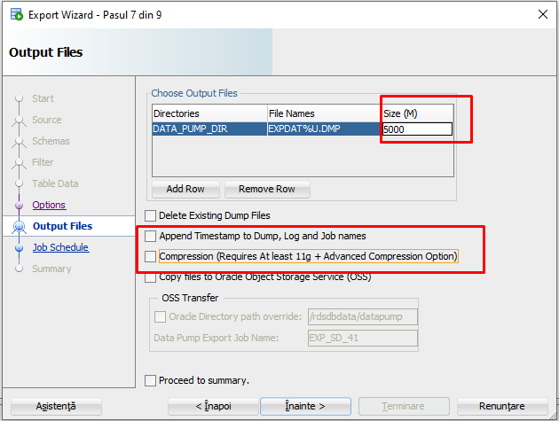

Click Next.

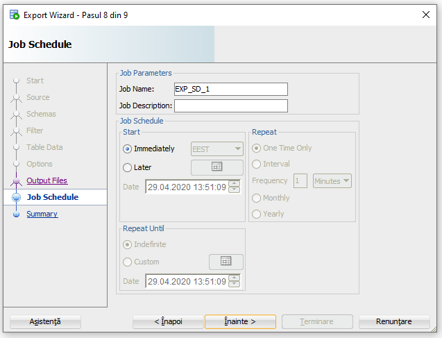

Click Finish.

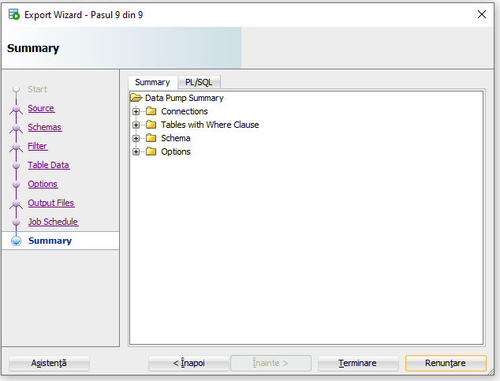

Notice the Job appears in the page and the state is Executing.

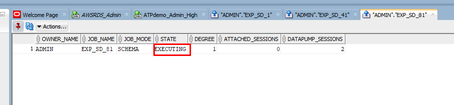

When the job ends the state changes to NOT RUNNING.

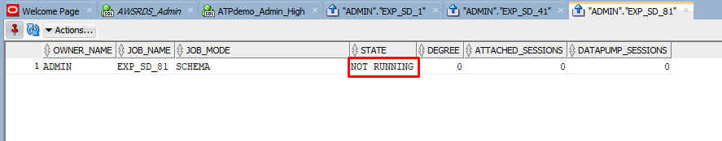


### 6.	Copy the dumpfile to AWS S3 Storage

[Documentation](https://docs.aws.amazon.com/AmazonRDS/latest/UserGuide/oracle-s3-integration.html#oracle-s3-integration.preparing)

To copy the dumpfile from the internal DATA_PUMP_DIR to the S3 bucket, run the following SQL.

```
SELECT rdsadmin.rdsadmin_s3_tasks.upload_to_s3(
      p_bucket_name    =>  'stagestorage', 
      p_prefix         =>  '', 
      p_s3_prefix      =>  '', 
      p_directory_name =>  'DATA_PUMP_DIR') 
   AS TASK_ID FROM DUAL;   
```

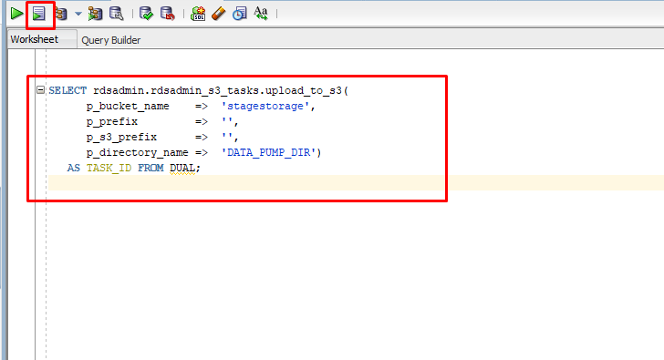

The result would be a task id like this: ```1588173984661-23```
To check the log for the task id, run the query:

```
SELECT text FROM table(rdsadmin.rds_file_util.read_text_file('BDUMP','dbtask-1588173984661-23.log')); 
```    
\
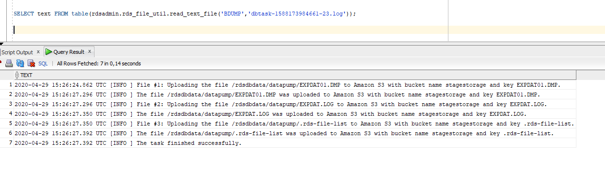
\
[S3 security guidelines and documentation](https://docs.aws.amazon.com/AmazonS3/latest/dev/access-control-block-public-access.html)  
When the upload is completed you can see the files in the bucket.
\
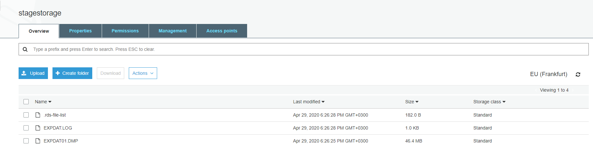
\
Click on the dump file.

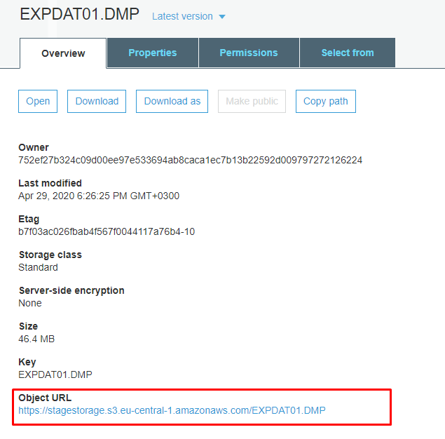

Note down the object URL because we are going to use it later.

### 7.	In Autonomous Database create credentials to AWS S3 Storage

Connect with SQL Developer 

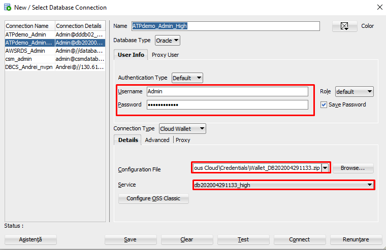

Get the AWS credentials like this:
- Sign in to the AWS Management Console and open the IAM console at https://console.aws.amazon.com/iam/.
- In the navigation pane, choose Users.
- Choose the name of the user whose access keys you want to manage, and then choose the Security credentials tab.
- In the Access keys section, do any of the following:
	- To create an access key, choose Create access key. Then choose Download .csv file to save the access key ID and secret access key to a CSV file on your computer. Store the file in a secure location. You will not have access to the secret access key again after this dialog box closes. After you download the CSV file, choose Close. When you create an access key, the key pair is active by default, and you can use the pair right away.

Run the following query to create the credentials to Amazon S3 Storage:

```
BEGIN
  DBMS_CLOUD.CREATE_CREDENTIAL(
    credential_name => 'AWS_CRED_NAME',
    username => 'Access Key ID',
    password => 'Secret Access Key'
  );
END;
/
```


### 8.	Datapump Import in Autonomous database

In the DBA tab select the ATP connection, expand Data Pump and right click on Import Jobs. Chose Data Pump Import Wizard.

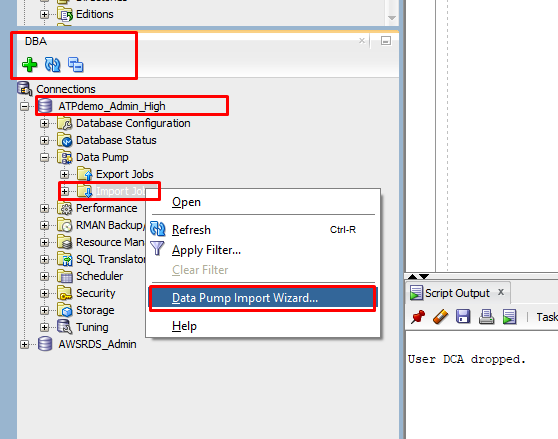

In the first step chose Schemas to import.
In the **Credentials or Directories** section, choose the Credentials created above: **AWS_CRED_NAME**.

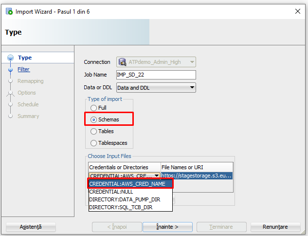

In the **File Names or URI** section, enter the object URL noted down at the end of step 6.\
Click Next.

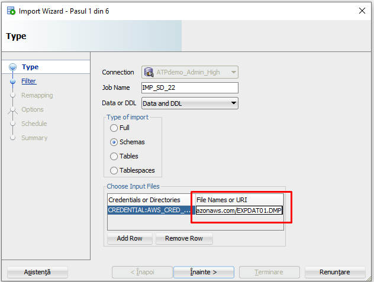

Wait a bit until the schema appears in the list. Chose the schema name and move it to the right panel.\
Click Next.

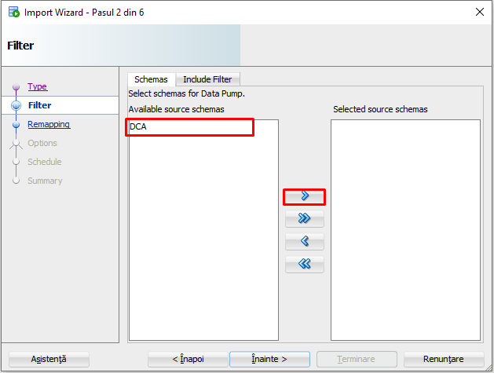

Click Next.

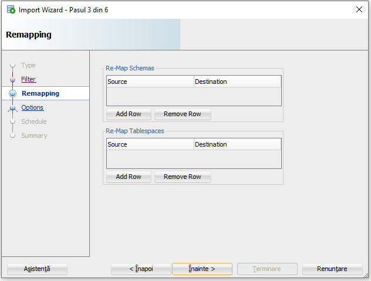

Click Next.

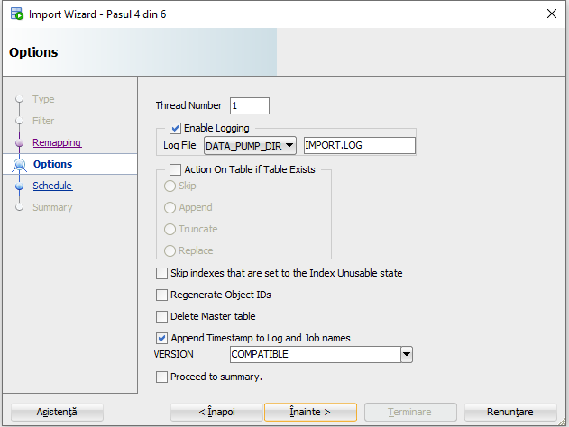

Click Next.

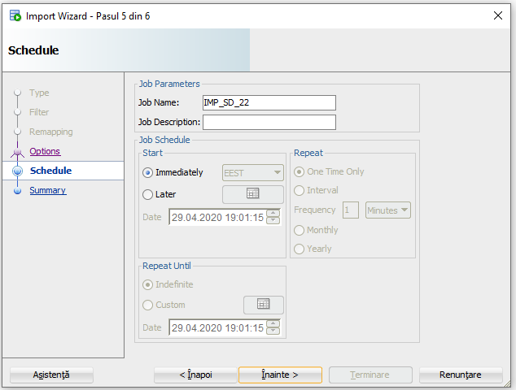

Click Finish.

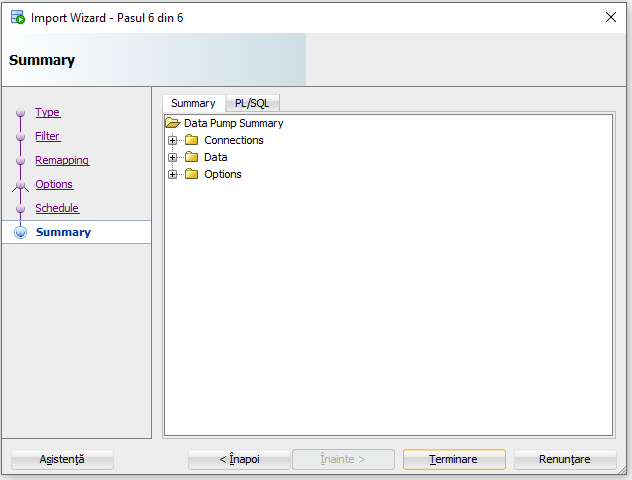

The job appears in the window with the EXECUTING state.

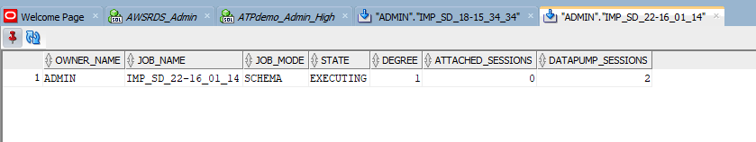

When the Job is finished the state changes to NOT RUNNING

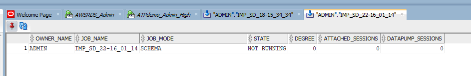

We can see the data was imported and run the same SQL statement from the beginning.
```
select * from dca.dca_sales_data;
```

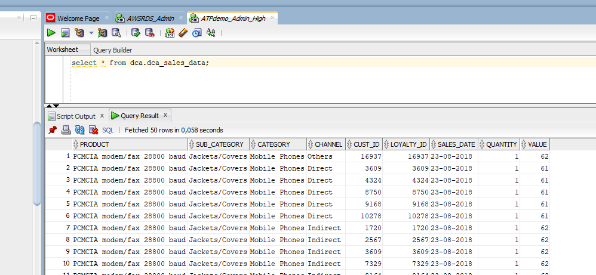